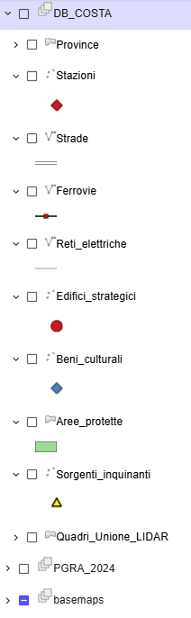

# 💻 Creazione Digital Twin e attivazione del servizio nell'area di interesse - SOLO UTENTI ADBPO


Accedere alla piattaforma tramite il link: [test.saferplaces.co](http://test.saferplaces.co/)


Cliccando sull'icona "_Create a project_", si avvia l'interfaccia che aiuta ad attivare il servizio e a generare il Digital Twin per l'area designata di interesse.

<figure><figcaption>
Create a new project
</figcaption></figure>

A questo punto i due passi principali da seguire per attivare il servizio sono:

1. Definizione dell'area di interesse
2. Creazione del gemello digitale

## Definizione dell'area di interesse

Per gli utenti di ADBPO abilitati, la procedura di attivazione del servizio SaferPlaces segue un wizard semplificato. Questo richiede soltanto la definizione dell'area di interesse e acquisisce automaticamente tutti i layer necessari alla generazione del Digital Twin e all'attivazione del servizio.

Nell'header in alto di fianco al logo di SaferPlaces è presenta una casella di ricerca che può essere utilizzata per cercare e zoomare su:

* località e comuni
* indirizzi  - icona globo
* bacini idrografici - icona layer

<figure><figcaption></figcaption></figure>

Sono state sviluppate 2 diverse modalità di attivazione della piattaforma SaferPlaces per una specifica area di interesse (AOI):&#x20;

1. SELECT BY BASIN&#x20;
2. SELECT BY AREA

In entrambi i casi è possibile selezionare la risoluzione a 2 metri oppure 1 metro.

La prima modalità si basa sulla selezione di uno o più province, tramite il pulsante SELECT BY BASIN. Basta cliccare con il mouse sulla provincia di interesse oppure tenere premuto il pulsante Shift per selezioni multiple.

<figure><figcaption>
Select by Basin
</figcaption></figure>

La seconda modalità invece consente di attivare l'AOI attraverso la definizione di un'area rettangolare, cliccando sul pulsante SELECT BY AREA. Per disegnare il rettangolo nell'ambiente di mappatura basta tenere premuto il tasto Shift e il tasto sinistro del mouse fino a disegnare un rettangolo che copre l'area di interesse.

<figure><figcaption>
Select by Area
</figcaption></figure>

Sul pannello di destra sono elencati i layers disponibili nell'area di interesse, che possono essere visualizzati anche nella fase di attivazione. Alcuni layers fanno riferimento a dati forniti da ADBPO.

<figure><figcaption></figcaption></figure>

Esempio di layer disponibile: Stazioni.

<figure><figcaption>
Layer Stazioni
</figcaption></figure>

Tra i layer a disposizione è presente anche il PGRA aggiornato al 2024.

<figure><figcaption></figcaption></figure>

### Video d'esempio per selezionare l'area di interesse

L'utente deve quindi definire un'area di attivazione scegliendo una delle due modalità:

* Selezionare uno o più province - cliccando sul pulsante SELECT BY BASIN



* Selezione di un area rettangolare - cliccando sul pulsante SELECT BY AREA



## Creazione del gemello digitale

Una volta definita l'AOI, un Wizard procede automaticamente attraverso cinque passaggi per scaricare o selezionare i layer di input necessari per attivare il nuovo progetto:

[step-1-dtm-adbpo-raster-geotiff.md](step-1-dtm-adbpo-raster-geotiff.md "mention") Modello digitale del terreno&#x20;

[step-2-edifici-adbpo-vettoriale-shapefile.md](step-2-edifici-adbpo-vettoriale-shapefile.md "mention")&#x20;

[step-3-tasso-di-infiltrazione-adbpo-raster-geotiff.md](step-3-tasso-di-infiltrazione-adbpo-raster-geotiff.md "mention")

[step-4-litologia-adbpo-raster-geotiff.md](step-4-litologia-adbpo-raster-geotiff.md "mention")

[step-5-layer-geospaziali-aggiuntivi-raster-e-vettoriali-adbpo-rest-service.md](step-5-layer-geospaziali-aggiuntivi-raster-e-vettoriali-adbpo-rest-service.md "mention")

[step-6-crea-e-finalizza-il-progetto-adbpo.md](step-6-crea-e-finalizza-il-progetto-adbpo.md "mention")


Attivando l'opzione _**Upload**_ nei diversi passaggi, è possibile caricare layer di proprietà dell'utente.


&#x20;

<figure><figcaption>
Interfaccia grafica per la creazione del gemello digitale della città
</figcaption></figure>

### Video Esempio di creazione di gemello digitale&#x20;


Esempio di creazione di digital twin (Gemello digitale)

