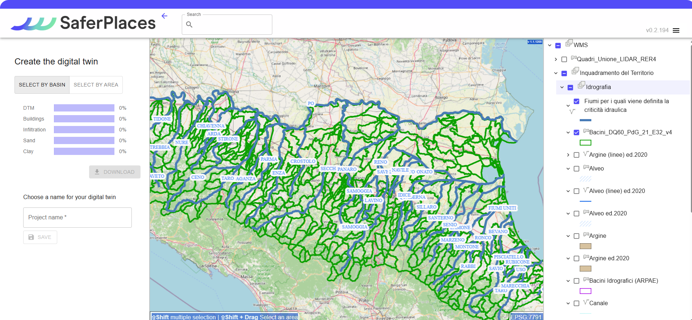

# 💻 Creazione Digital Twin e attivazione del servizio nell'area di interesse - SOLO UTENTI REGIONE ER

Cliccando sull'icona "_Create a project_", si avvia l'interfaccia guidata che aiuta ad attivare il servizio e a generare il Digital Twin per l'area designata di interesse.

<figure><figcaption>
Create a new project
</figcaption></figure>

Per gli utenti della Protezione Civile della Regione Emilia-Romagna abilitati, la procedura di attivazione del servizio Saferplaces segue un wizard semplificato. Questo richiede soltanto la definizione dell'area di interesse e acquisisce automaticamente tutti i layer necessari alla generazione del Digital Twin e all'attivazione del servizio.

Nell'header in alto di fianco al logo di SaferPlaces è presenta una casella di ricerca che può essere utilizzata per cercare e zoomare su:

* località e comuni
* indirizzi  - icona globo
* bacini idrografici - icona layer

<figure><figcaption></figcaption></figure>

Sono state sviluppate 2 diverse modalità di attivazione della piattaforma SaferPlaces per una specifica area di interesse (AOI).\
La prima modalità attraverso la definizione di un rettangolo, selezionando SELECT BY AREA

<figure><figcaption>
Select by Area
</figcaption></figure>

La seconda modalità invece mediante la selezione di uno o più bacini idrografici

<figure><figcaption>
Select By Basins
</figcaption></figure>

L'utente deve definire un'area di attivazione scegliendo una delle due modalità:

* Selezione di un area rettangolare - cliccando sul pulsante SELECT BY AREA
* Selezionare uno o più bacini idrografici - cliccando sul pulsante SELECT BY BASIN

Sul pannello di destra sono elencati i layers che possono essere visualizzati anche nella fase di attivazione dell'AOI.

Alcuni layers fanno riferimento a servizi GIS REST della Regione Emilia-Romagna.

<figure><figcaption></figcaption></figure>

Una volta definita l'area (Area rettangolare o bacino idrografico) , il Wizard procede automaticamente a scaricare i layer di input necessari per attivare il nuovo progetto:

[step-1-dtm-raster-geotiff.md](step-1-dtm-raster-geotiff.md "mention") Modello digitale del terreno&#x20;

[step-2-edifici-vettoriale-shapefile.md](step-2-edifici-vettoriale-shapefile.md "mention")&#x20;

[step-3-tasso-di-infiltrazione-raster-geotiff.md](step-3-tasso-di-infiltrazione-raster-geotiff.md "mention")

[step-4-litologia-raster-geotiff.md](step-4-litologia-raster-geotiff.md "mention")

[step-5-layer-geospaziali-aggiuntivi-raster-e-vettoriali.md](step-5-layer-geospaziali-aggiuntivi-raster-e-vettoriali.md "mention")

[step-6-crea-e-finalizza-il-progetto.md](step-6-crea-e-finalizza-il-progetto.md "mention")

&#x20;

### Video Esempio di creazione di gemello digitale tramite "Select by area"



### Video Esempio di creazione di gemello digitale tramite "Select by basin"



