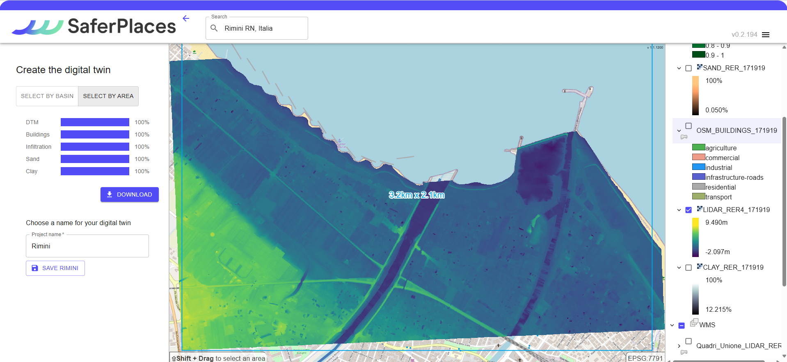
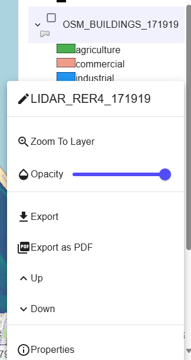

# STEP 1  DTM RER - Raster GeoTiff

Il modello digitale del terreno (DTM) fornito nella piattaforma Saferplaces per gli utenti della Protezione Civile dell'Emilia Romagna è una versione aggiornata al 2024. Questo include il mosaico LIDAR su tutto il territorio regionale.

<figure><figcaption></figcaption></figure>

Cliccando con il tasto destro sul layer in oggetto, è possibile:

* modificare il nome del Layer
* Zoomare sul layer
* modificare la trasparenza
* esportare il file come geo.tiff
* esportarne la visualizzazione in pdf
* modificare la posizione del layer nella lista tramite i tasti Up e Down
* leggere le proprietà del file (origine e simbologia)

<figure><figcaption>
Modifiche ai layer
</figcaption></figure>

<figure><figcaption>
proprietà Layer DTM - Source
</figcaption></figure> <figure><figcaption>
proprietà Layer DTM - Symbology
</figcaption></figure>

