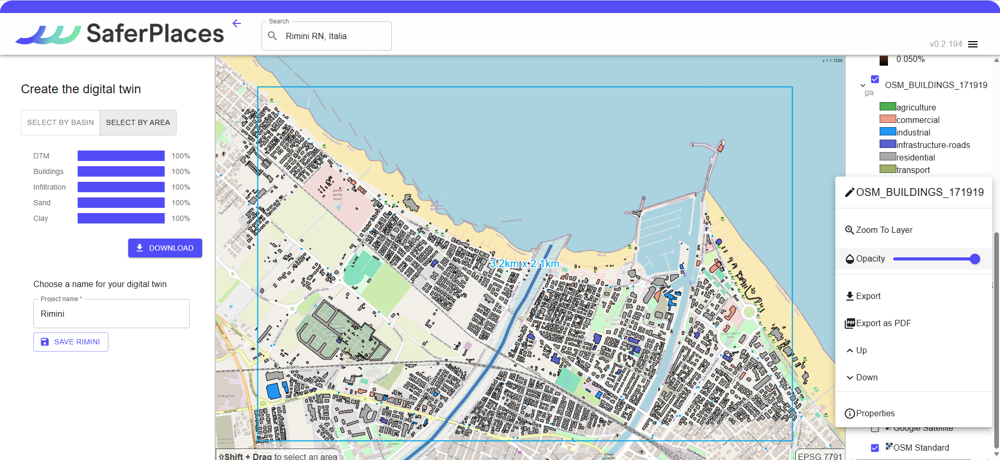
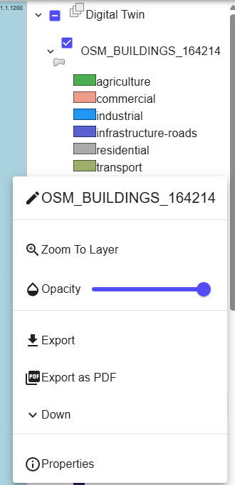

# STEP 2 Edifici RER - Vettoriale ShapeFile

Il layer relativo alla sagoma degli edifici è ottenuto da dati forniti da Overture Maps Foundation, assicurando l'accuratezza e l'aggiornamento costante delle informazioni geografiche.

<figure><figcaption></figcaption></figure>

Cliccando con il tasto destro sul layer in oggetto, è possibile:

* modificare il nome del Layer
* Zoomare sul layer
* modificare la trasparenza
* esportare il file come geo.tiff
* esportarne la visualizzazione in pdf
* modificare la posizione del layer nella lista tramite i tasti Up e Down
* leggere le proprietà del file (origine, simbologia e label)

<figure><figcaption>
Modifiche ai layer
</figcaption></figure>

<figure><figcaption>
proprietà Layer  - Source
</figcaption></figure> <figure><figcaption>
proprietà Layer  - Symbology
</figcaption></figure> <figure><figcaption>
proprietà Layer  - Labels
</figcaption></figure>

