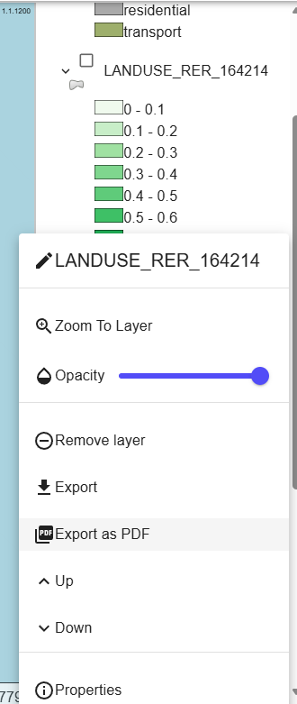
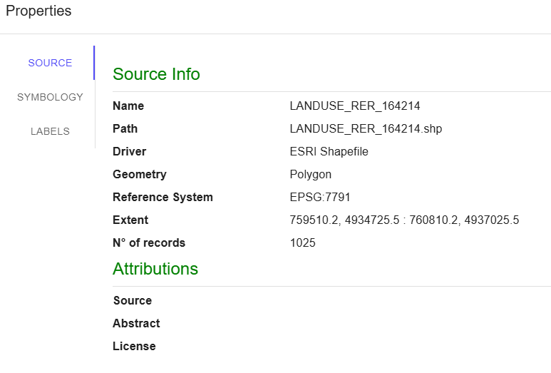
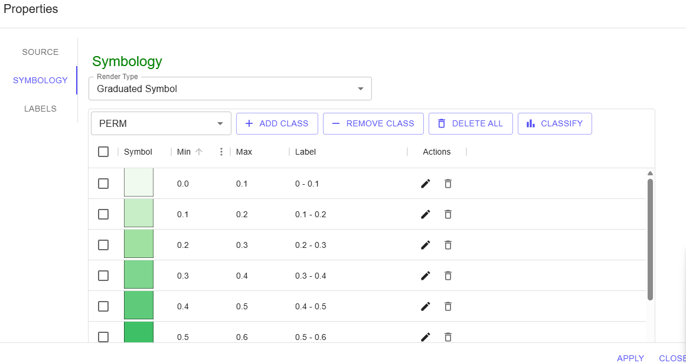
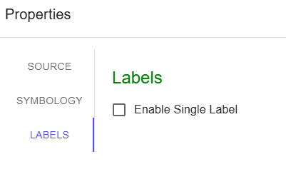

# STEP 3 Tasso di infiltrazione RER - Raster GeoTiff

Il tasso di infiltrazione è determinato dall'uso del suolo secondo il CORINE Land Cover della Regione Emilia

<figure><figcaption></figcaption></figure>

Cliccando con il tasto destro sul layer in oggetto, è possibile:

* modificare il nome del Layer
* Zoomare sul layer
* modificare la trasparenza
* esportare il file come geo.tiff
* esportarne la visualizzazione in pdf
* modificare la posizione del layer nella lista tramite i tasti Up e Down
* leggere le proprietà del file (origine, simbologia e label)

<figure><figcaption>
Modifiche ai layer
</figcaption></figure>

<figure><figcaption>
Source Layer - Source
</figcaption></figure> <figure><figcaption>
proprietà Layer - Symbology
</figcaption></figure> <figure><figcaption>
proprietà Layer - Label
</figcaption></figure>

