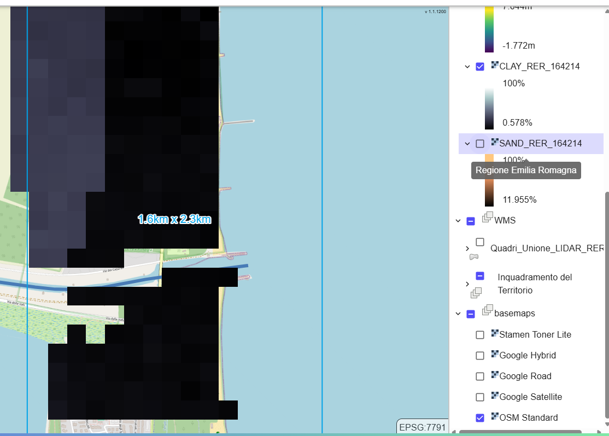
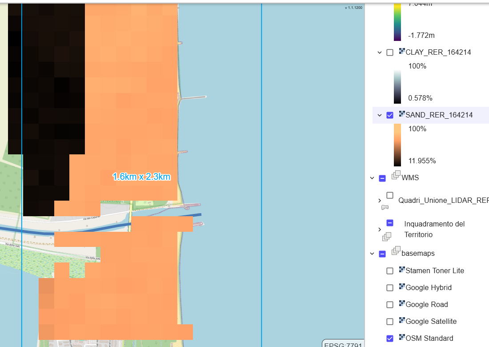

# STEP 4 Litologia RER - Raster GeoTiff

### Classi Tessiturali dei Suoli:

Le classi tessiturali dei suoli regionali per lo strato superficiale da 0 a 30 cm sono cruciali per comprendere le caratteristiche fisiche del suolo. Queste informazioni sono derivate dalle [Carte delle proprietà chimico-fisiche ](https://datacatalog.regione.emilia-romagna.it/catalogCTA/dataset/r_emiro_2023-08-02t140310)e forniscono una base per analizzare la composizione granulometrica, che include la percentuale di sabbia, limo e argilla.

Per ulteriori dettagli sulle modalità di raccolta e analisi dei dati, si rimanda alla sezione metodologica del documento.

<figure><figcaption>
Clay
</figcaption></figure> <figure><figcaption>
Sand
</figcaption></figure>

Cliccando con il tasto destro sui layers in oggetto, è possibile:

* modificare il nome del Layer
* Zoomare sul layer
* modificare la trasparenza
* esportare il file come geo.tiff
* esportarne la visualizzazione in pdf
* modificare la posizione del layer nella lista tramite i tasti Up e Down
* leggere le proprietà del file (origine e simbologia)
