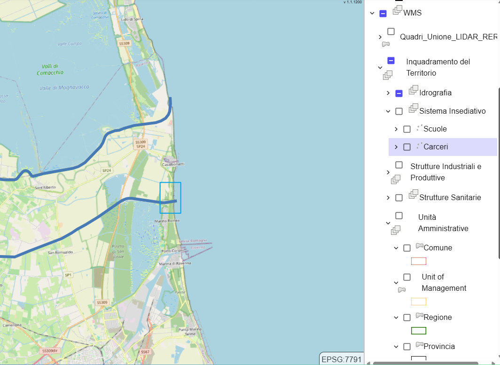

# STEP 5 Layer Geospaziali aggiuntivi - raster e vettoriali - REST Service

Durante l'attivazione del servizio, i servizi Web GIS REST della Regione Emilia-Romagna vengono integrati automaticamente, garantendo l'accesso a una serie di funzionalità geospaziali aggiornate e pertinenti.

<figure><figcaption>
WMS Regione Emilia Romagna
</figcaption></figure>
