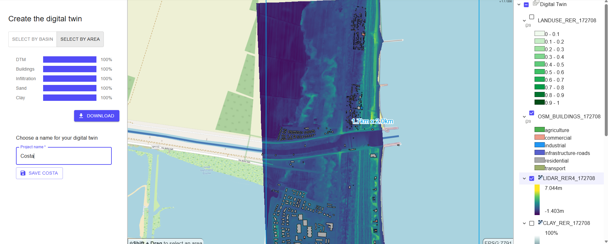
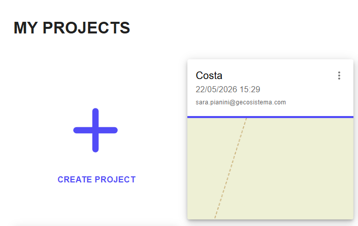

# STEP 6 Crea e Finalizza il Progetto RER

Nel passaggio finale della procedura di attivazione del servizio, viene richiesto di assegnare un nome al progetto e di salvarlo.\
Dopo il salvataggio, la piattaforma mostra l'aggiunta del nuovo progetto

<figure><figcaption>
Possibilità di salvare il progettop dopo il download
</figcaption></figure> <figure><figcaption>
Progetto aggiunto alla schermata iniziale
</figcaption></figure>

