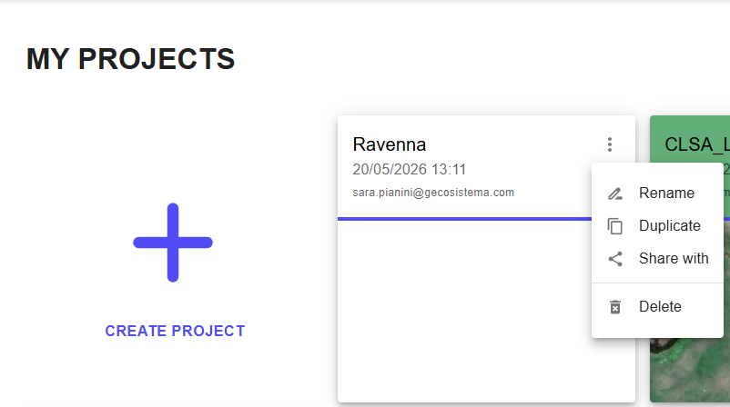

# 🚀 Pagina My Projects

Accedendo tramite LOGIN, si può accedere alla pagina personale, che include sia i progetti generati in precedenza sia la possibilità di generare nuove aree/città per attivare la Piattaforma Saferplaces.

<figure><figcaption>
Pagina Personale - My Projects
</figcaption></figure>


Clicca sulle 3 linee in alto a destra per accedere a:

* Profilo Utente
* Impostazioni Profilo Utente
* Uso delle risorse cloud
* Logout


<figure><figcaption></figcaption></figure>


Cliccando sui tre puntini in alto a destra del nome del progetto, puoi:

* Rinominare il progetto
* Duplicare il progetto
* Condividere il progetto
* Eliminare il progetto


<figure><figcaption></figcaption></figure>

