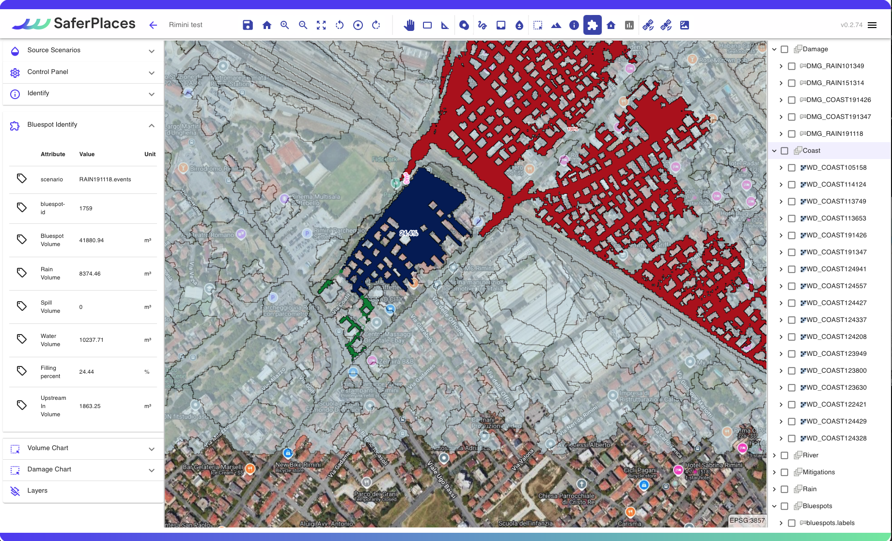
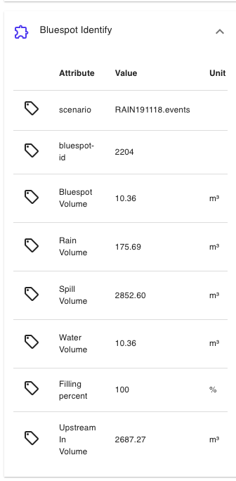

# 🛠️ Visualizzazione dei risultati

Pochi minuti dopo l'esecuzione della simulazione, l'utente può visualizzare i risultati, che si dividono in due tipi di layer spaziali:

* Un layer Raster GeoTiff che rappresenta sia l'estensione che la profondità dell'acqua delle aree allagate (in blu)
* Un layer vettoriale ShapeFile per il calcolo del danno economico per ciascun edificio allagato. Questo layer appare solo se si è attivato il calcolo del danno nel Wizard di simulazione.

I due layer geospaziali vengono caricati automaticamente nelle categorie specifiche che corrispondono alla loro fonte di pericolo: “_RAINFALL, RIVER, COASTAL_ o _DAMAGE_”.&#x20;

Il nome del Layer generato contiene il nome della simulaizone definito in fase di generazione dello scenario con davanti i suffissi:

* WD\_ Nel caso dei layer di allagamento
* DMG\_ Nel caso dei layer di Danno Economico

#### Generazione di Output dai Modelli di Simulazione

I modelli di simulazione producono una serie di layer raster di output a intervalli definiti dai parametri di simulazione. Questi output sono organizzati in sottogruppi con il nome della simulazione (es. WD\_RIVER164153). I raster corrispondono a punti temporali specifici in secondi (es. @600 sec equivale a 10 minuti).

Nello stesso gruppo sono inclusi anche un raster dei valori massimi di profondità dell'acqua (.max) e un file vettoriale che rappresenta l'estensione massima dell'allagamento (.mask).

<figure><figcaption></figcaption></figure>

Nel gruppo dei risultati di UNTRIM è possibile cliccando sull'icona play  generare una visualizzazione dinamica dell'evoluzione temporale dell'allagamento simulato dal modello [untrim.md](../simulazioni-allagamento-pericolo-e-danno/modelli-di-allagamento-hazard-saferplaces/untrim.md "mention").

<figure><figcaption></figcaption></figure>




Puoi scaricare gli output generati come file raster Geotiff o shapefile vettoriali. Basta fare clic con il tasto destro sul layer desiderato e selezionare "_Export_" (Esporta).


&#x20;Inoltre i seguenti  strumenti disponibili nella [barra-superiore.md](../saferplaces-interfaccia-gui-web/barra-superiore.md "mention") aiutano a esaminare i risultati ottenuti:&#x20;

Section  - Sezione Trasversale

 (1).png>)

Lo strumento "Sezione" ti consente di determinare facilmente la profondità dell'acqua per un'area specifica tracciando una linea su qualsiasi layer di profondità dell'acqua. Una nuova finestra in basso sullo schermo mostra la sezione trasversale dell'area selezionata.

.png>)

“<em>Identify</em> " 

.png>)

Lo Strumento _Identifica_ fornisce informazioni in un punto specifico per i layer geospaziali attivi.

&#x20;Per il layer di allagamento attivo, mostra la profondità dell'acqua; per gli edifici selezionati, visualizza i danni economici basati sui layer di danno economico attivi  sulla [barra-laterale-destra.md](../saferplaces-interfaccia-gui-web/barra-laterale-destra.md "mention")

I risultati appariranno nel pannello delle attività corrispondente sulla sinistra.

"<em>Bluespots</em>" 

.png>)

Lo strumento "_Bluespots_" è un tool di analisi specifica dei risultati relativi a [simulazione-allagamento-pluviale.md](../simulazioni-allagamento-pericolo-e-danno/definizione-scenario-source-scenarios/simulazione-allagamento-pluviale.md "mention") ottenute dal modello [safer\_rain.md](../simulazioni-allagamento-pericolo-e-danno/modelli-di-allagamento-hazard-saferplaces/safer_rain.md "mention").&#x20;

Esso è presente  nella [barra-superiore.md](../saferplaces-interfaccia-gui-web/barra-superiore.md "mention") ed una volta attivato richiede di selezionare nel menu a tendina il  [#nome-simulazione](../simulazioni-allagamento-pericolo-e-danno/definizione-scenario-source-scenarios/simulazione-allagamento-costiero.md#nome-simulazione "mention")per la [simulazione-allagamento-pluviale.md](../simulazioni-allagamento-pericolo-e-danno/definizione-scenario-source-scenarios/simulazione-allagamento-pluviale.md "mention") in cui si vuole procedere nell'analisi.

Una volta attivato, si accenderanno automaticamente nella [barra-laterale-sinistra.md](../saferplaces-interfaccia-gui-web/barra-laterale-sinistra.md "mention")i layers del gruppo [#bluespots](visualizzazione-dei-risultati.md#bluespots "mention"), muovendosi con il mouse nei diversi sotto-bacini si attiveranno nella [barra-laterale-destra.md](../saferplaces-interfaccia-gui-web/barra-laterale-destra.md "mention")una specifica finestra con le singole voci del bilancio di massa del sotto-bacino in esame, mentre nella mappa verranno evidenziati i seguenti sotto-bacini:

* i bacini (VERDE) che afferiscono volume verso il bluespot in esame (BLUE)
* i bacini (ROSSO) che riceveono volume dal bacino in esame (BLUE)

Nella [barra-laterale-sinistra.md](../saferplaces-interfaccia-gui-web/barra-laterale-sinistra.md "mention")le voci del bilancio idrologico sono le seguenti:

* Scenario= [#nome-simulazione](../simulazioni-allagamento-pericolo-e-danno/definizione-scenario-source-scenarios/simulazione-allagamento-pluviale.md#nome-simulazione "mention") dello scenario di [simulazione-allagamento-pluviale.md](../simulazioni-allagamento-pericolo-e-danno/definizione-scenario-source-scenarios/simulazione-allagamento-pluviale.md "mention")
* bluespot-d= identificativo del sotto bacino/depressione
* Bluespot Volume = Volume in mc della depressione vuota
* Rain Volume = Volume di acqua che riempie la depressione per la pioggia
* Spill Volume = Volume in mc di acqua che riempie i sotto-bacino di valle (ROSSO) in caso di overspill ovvero troppo pieno
* Water Volume = Volume di acqua in mc presente nella depressione, questo valore è sempre minore uguale di Bluespot Volume
* Filling Percent % = percentuale di riempimento della depressione
* UpStream IN Volume = volume di acqua in mc che arriva dalle depressioni di monte (VERDE) che per troppo pieno (overspill) scaricano sulla depressione in esame

"<em>Volume Chart</em>” e “<em>Damage Chart</em>”

.png>)

Nella [barra-superiore.md](../saferplaces-interfaccia-gui-web/barra-superiore.md "mention") sono presenti due strumenti dedicati per interrogare sia i layer di allagamento che di danno economico mediante uno strumento di selezione areale (poligono).

Questi strumenti denominati rispettivamente  “_Volume Chart_” e “_Damage Chart_” riportano una statistica dei valori di allagamento e danno compresi nel poligono di selezione generato dall'utente.

Una volta attivato il pulsante, l'utente tendo premuto il tasto destro del mause può disegnare un poligono a mano libera.

Nella [barra-laterale-sinistra.md](../saferplaces-interfaccia-gui-web/barra-laterale-sinistra.md "mention") si attiva un task di viuslizzazzione che riporta due o più istrogrammi relativi ai layer di allagamento o danno attivati sulla [barra-laterale-destra.md](../saferplaces-interfaccia-gui-web/barra-laterale-destra.md "mention").

ATTENZIONE - Attivare sempre un layer oggetto dell'analisi altrimenti non si visualizzano istrogrammi.

.png>)

.png>)

## Esempio di visualizzazione dei risultati di una simulazione



