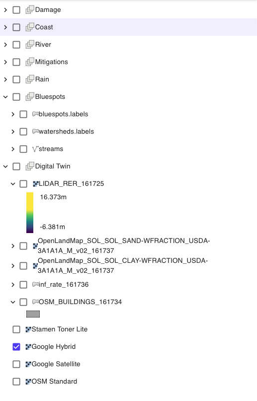
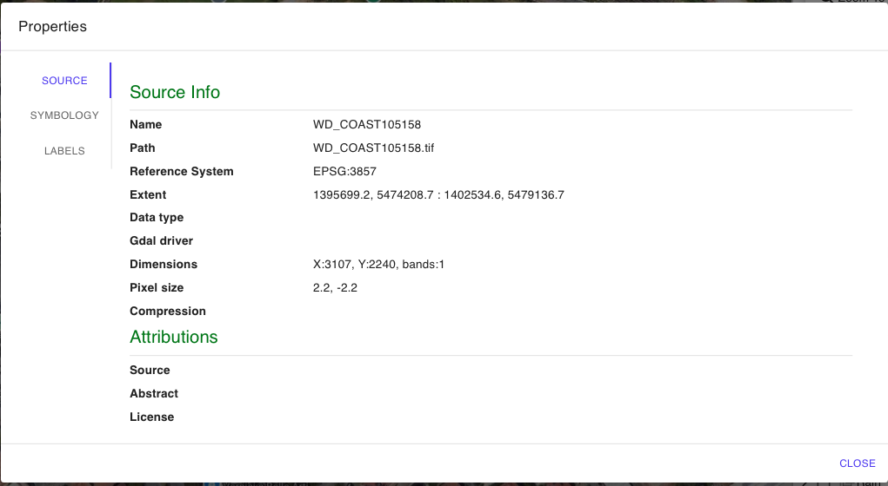
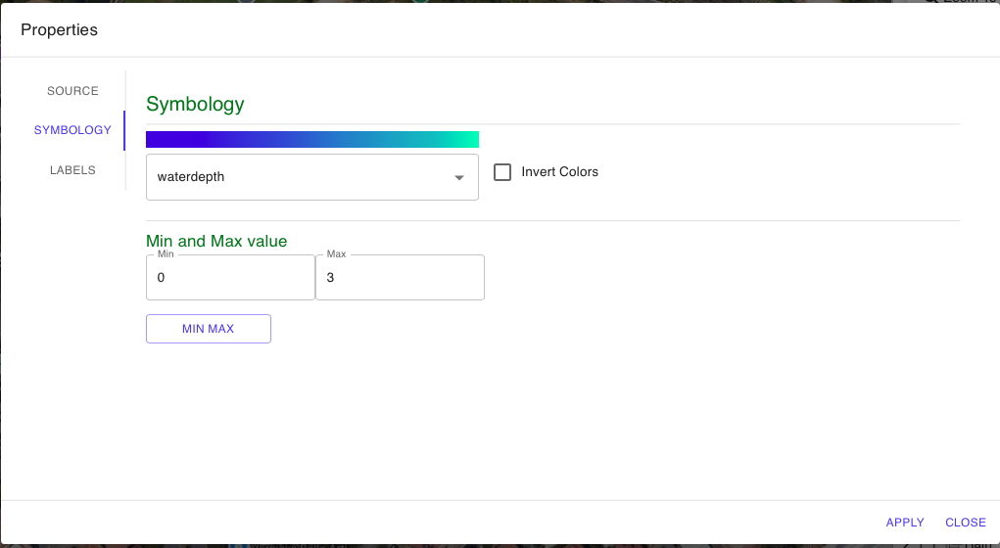
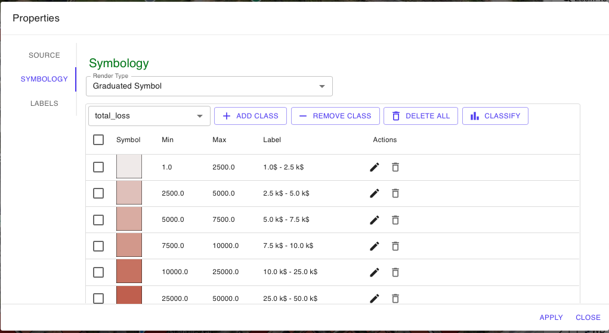
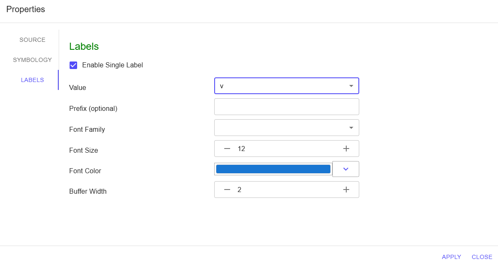

# Barra Laterale destra

A destra della schermata principale, troverai un pannello che elenca tutti i layer geospaziali ("layers") utilizzati per l'attivazione del  [gemello-digitale-digital-twin.md](../gemello-digitale-e-attivazione-nuovo-servizio/gemello-digitale-digital-twin.md "mention") e i layer relativi ai risultati delle [Broken link](/broken/pages/bkKmSWCzopoSCuv12rbq "mention").

I layers geospaziali del progetto sono organizzati nei seguenti gruppi di layers:

* DAMAGE - gruppo di layers dei risultati delle simulazioni di [modello-di-danno-economico-safer\_damage.md](../simulazioni-allagamento-pericolo-e-danno/modello-di-danno-economico-safer_damage.md "mention")
* RAIN - gruppo di layers dei risultati delle simulazioni di [simulazione-allagamento-pluviale.md](../simulazioni-allagamento-pericolo-e-danno/definizione-scenario-source-scenarios/simulazione-allagamento-pluviale.md "mention")
* RIVER - gruppo di layers dei risultati delle simulazioni di [simulazione-allagamento-fluviale.md](../simulazioni-allagamento-pericolo-e-danno/definizione-scenario-source-scenarios/simulazione-allagamento-fluviale.md "mention")
* COAST - gruppo di layers dei risultati delle simulazioni di [simulazione-allagamento-costiero.md](../simulazioni-allagamento-pericolo-e-danno/definizione-scenario-source-scenarios/simulazione-allagamento-costiero.md "mention")
* Mitigation - gruppo di layers che contiene i vettoriali shapefile delle misure di mitigazione, quali barriere e serbatoi
* Bluespots - gruppo di layers che contiene i vettoriali shapefile di:
  * bluespots.labels - vettoriale delle depressioni dei sotto-bacini (watersheds.labels)
  * stream - veootoriale degli "streams" ovvero line di flusso che idrologicamente connettono i diversi "Bluespots"
  * watersheds.labels - vettoriale dei sotto-bacini idrologici
* Digital Twin - gruppo di layer utilizzati e/o caricati nella fase di [creazione-digital-twin-e-attivazione-del-servizio-nellarea-di-interesse](../gemello-digitale-e-attivazione-nuovo-servizio/creazione-digital-twin-e-attivazione-del-servizio-nellarea-di-interesse/ "mention")
  * layer DTM - relativo al Modello Digitale del Terreno
  * layers di classe tessiturale  litologica (Sand e Clay)
  * layer di infiltrazione ottenuto riclassificando uso del suolo
  * layer foot print (sagoma) degli edifici - OSM o caricato da utente
* Layer Mappe di Background
* Google Map Hybrid o satellite
* OSM
* Stamen

<figure><figcaption></figcaption></figure>

Facendo clic con il pulsante destro del mouse su ciascun layer o relativo gruppo , l'utente può attivare alcune funzioni utili elencate nella figura&#x20;

<figure><figcaption></figcaption></figure>

In particolare è possibile:

* modificare il nome del Lyer
* ZOOM TO LAYER - zoomare sul layer selezionato
* OPACITY - aumentare o diminuire la sua opacità
* REMOVE LAYER rimuovere layer dal progetto
* EXPORT - salvare su file il layer (Geotiff o Shapefile)
* PROPERTIES - ispezionare e modificare  le sue proprietà.

Attivando le PROPERTIES sul laye di interesse è possibile in particolare:

* SOURCE - visualizzare i metadati del layer&#x20;

<figure><figcaption></figcaption></figure>

* SYMBOLOGY - modificare la scala di colori del layer raster o vettoriale

<figure><figcaption></figcaption></figure>

<figure><figcaption></figcaption></figure>

* LABEL (solo per file vettoriali) che permette la visualizzazione di un'etichetta descrittiva di un attributo, visualizzata sulla mappa.

<figure><figcaption></figcaption></figure>

