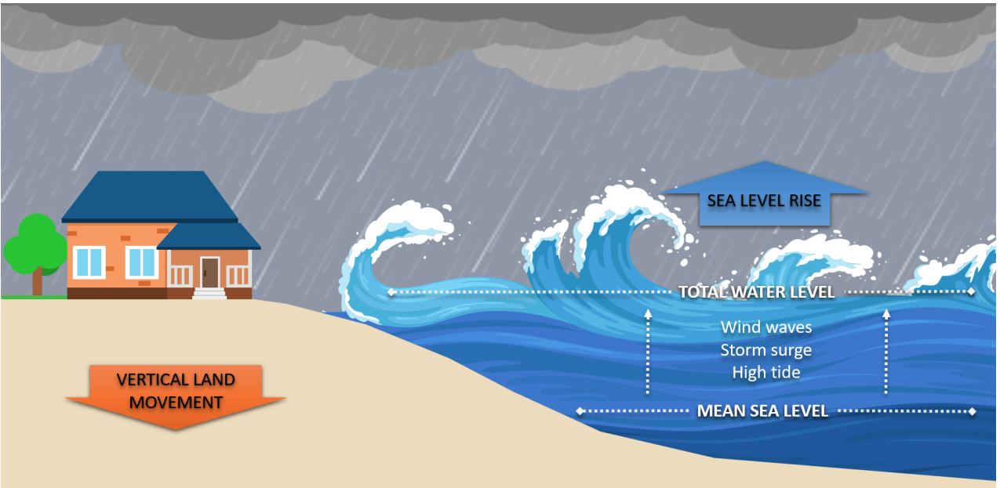
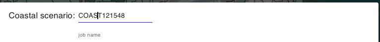
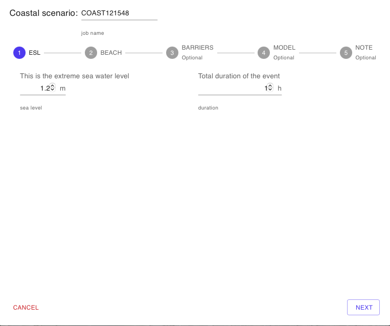
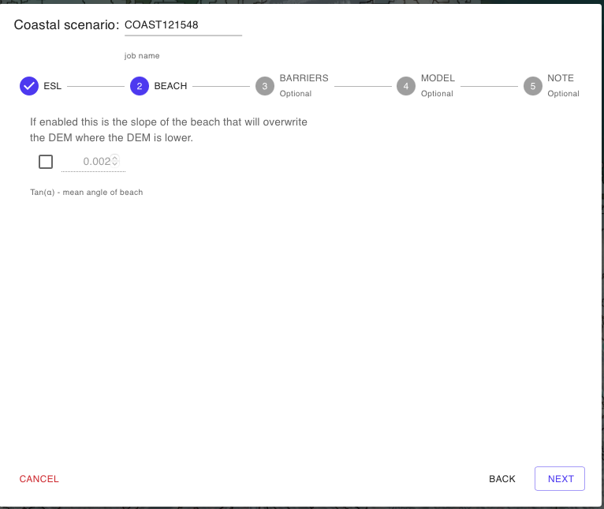
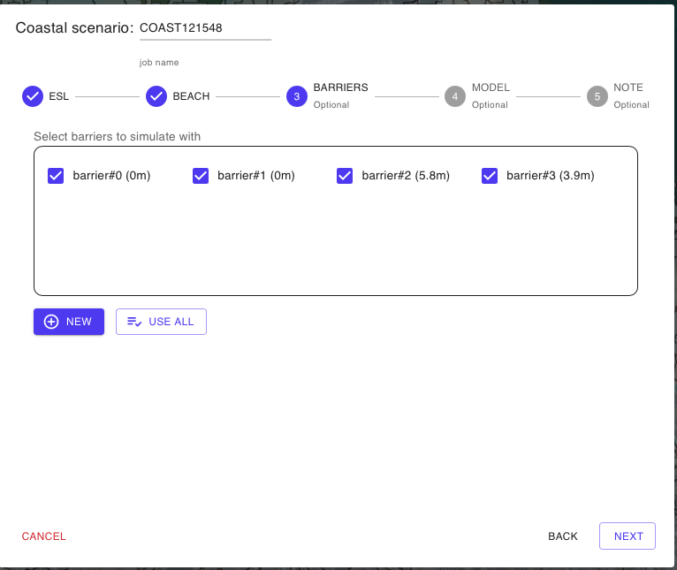
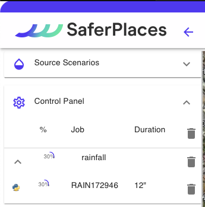

# 🏖️ Simulazione Allagamento Costiero

INella sezione “_Coastal scenario_” (scenario costiero) gli utenti possono creare e definire uno scenario di allagamento costiero basato su un livello del mare estremo specifico, misurato in metri, combinando i seguenti fattori:

* Livello di Marea
* Livello da Storm Surge
* Livello da "Wave Run Up"

<figure><figcaption></figcaption></figure>

## COASTAL: -SIMULAZIONE ALLAGAMENTO COSTIERO

La procedura guidata -Wizard si articola nei seguenti step:

Nome Simulazione

L'utente può modificare il nome della simulaizone editando liberamente il nome che viene assegnato automaticamente. Si consiglia di utilizzare un nome composto da caratteri standard e numeri senza uso dello spazio e/o simboli.

Extreme Sea Level (1-ESL)

Il primo step consiste nella definizione del livello del mare ovvero Extreme Sea Level (ESL) in metri, si tratta di una quota definita rispetto al livello del medio mare.\
In aggiunta alla quota in caso si voglia procedere con una simulazione di modellistica idrodinamica occorre anche definire la durata temporale in ore  del livello ESL che si intende simulare.

Pendenza della spiaggia (2-BEACH)

In questo secondo step, l'utente definisce la pendenzza della spiaggia espressa cone Tangente dell'angolo (alfa) in gradi. Questa opzione consenti di attenuare l'avanzamento del livello del mare da propagare ipotizzando di generare un DTM virtuale pari al max tra il Valore reale del DTM e il valore di un piano inclinato con pendenza alfa a partire dalla linea di costa. (ref.[https://nhess.copernicus.org/articles/16/181/2016/](https://nhess.copernicus.org/articles/16/181/2016/))

Barriere Fisiche (3-BARRIERS)

In questo step, l'utente può inserire una o più barriere fisiche sulla mappa del dominio di calcolo per arginare scenari di allagamento costiero.

Per attivare lo strumento di modifica delle barriere fisiche, cliccare sul pulsante "NEW". Si avvierà lo strumento "_Draw Barrier_, lo stesso presente nella [barra-superiore.md](../../saferplaces-interfaccia-gui-web/barra-superiore.md "mention").

Una volta attivato, l'utente può aggiungere una nuova barriera cliccando con il tasto destro e selezionando "NEW" dal menu a tendina.

Modello di Calcolo (4-MODEL)

In questa sezione del Wizard l'utente ha la possibilità di&#x20;

1. Selezionare il modello di Allagamento (Hazard)
2. Attivare il calcolo del Dannno Economico (Damage)

I modelli di allagamento Costiero disponibili sono:&#x20;

* [safer\_coast.md](../modelli-di-allagamento-hazard-saferplaces/safer_coast.md "mention") - Modello raster-based bath-tube&#x20;
* [untrim.md](../modelli-di-allagamento-hazard-saferplaces/untrim.md "mention") - Modello Idrodinamico 2D

L'opzione di default è sempre il modello [safer\_coast.md](../modelli-di-allagamento-hazard-saferplaces/safer_coast.md "mention")

Nel caso si selezioni il modello [untrim.md](../modelli-di-allagamento-hazard-saferplaces/untrim.md "mention") occorre definire i seguenti parametri "Settings" cliccando sul task dedicato.&#x20;

* Slider - Durata della Simulazione in ore (h) -Tmax - Max time of simulation
* Slider - Coefficiente di scabrezza Manning  -Manning Coefficient
* Slider - Cella di calcolo in numero di pixel -nl - The number of pixel for each element side&#x20;
* Slider - Tempo di integrazione numerico  (min) -Delta T - Time simulation step
* Slider - Frequenza Stampa Output  (min) -Ti - Time shoot interval

L'attivazione del modello di calcolo del Danno Economico procede spuntando il check-box "Apply Damage"

Definizione dei parametri del modello di calcolo

Modello UNTRIM - Nel caso si sia selezionato il modello idrodinamico [untrim.md](../modelli-di-allagamento-hazard-saferplaces/untrim.md "mention") occorre specificare alcuni parametri molto importati di simulazione selezionando con gli slider i valori.

* Durata della Simulazione in ore (h) - il valore da selezionare corrisponde alla durata dell'evento che si vuole simulare, ad esempio se l'evento di rilascio fluviale dura 2h la durata della simulazione deve essere maggiore o uguale alla durata dell'evento
* Manning Coefficient (adim) - coefficiente di attrito di Manning che viene ipotizzato uniforme nel dominio di calcolo. Valore Consigliato 0.2
* nl (m) - Dimensione della cella di calcolo quadrata definita come numero dei pixel in metri. Ad esempio se si seleziona 50 e il lidar del dominio ha una risoluzione di 2 m allora la dimensione della cella è pari a 100m. In questo caso nel caso di Lidar a risoluzione 1/2 si consigli un valore tra 20 e 50. La dimensione della cella di calcolo influisce sul numero totale delle celle di calcolo in funzione anche della estensione del dominio. Il numero totale influisce a sua volta sul tempo di calcolo. Si consiglia rimanere al di sotto delle 20000 celle nell'intero dominio per avere tempi di calcolo contenuti (3 minuti per ogni ora di simulazione )
* Delta T - Passo di imntegrazione numerico (sec) - Si consiglia di selezionare il passo di integrazione pari a 6 secondi.
* Ti - Time Shot Interval (min) - Qui si definisce l'intervallo temporale di produzione degli output

Attivazione Calcolo del Danno Economico - DAMAGE

Nella procedura guidata alla pagina "Model" è possibile attivare il calcolo del danno economico per ciascun edificio inserito.

Il calcolo del Danno Economico viene eseguito in prima analisi applicando le seguenti ipotesi:

1. Tutti gli edifici cono considerati residenziali con un curva di vulnerabilità residenziale
2.  Valore dell'edificio pari a 1000 euro/mq\

    <figure><figcaption></figcaption></figure>

Inserimento metadati e descrizione della simulazione generata (5-NOTE)

Cliccando sul pulsante EDIT l'utente può attivare una casella di testo dove inserire metadati e dettagli descrittivi della simulazione che ha appena creato.Cliccando sul pulsante

RUN SIMULAZIONE

Cliccando sul pulsante RUN l'utente attiva l'esecuzione della simulazione creata.\
Dopo l'avvio sul pannello Control Panel si aggiungerà l'esecuzione del processo attivato con indicazione dello stato di avanzamento.

## Video Aggiunta e Editing Barriere Fisiche



## Esempio di simulazione costiera con SAFER\_COAST



## Esempio di simulazione costiera con BARRIERE


