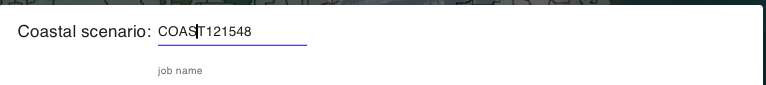
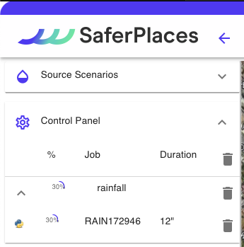

# 💦 Simulazione Allagamento Fluviale

_Nella sezione "Scenario Fluviale"_, gli utenti possono definire e generare uno scenario di allagamento fluviale. Questo può derivare da un rilascio volumetrico, una rottura arginale o sormonto (overtopping), con la fuoriuscita di un flusso o volume d'acqua entro un intervallo di tempo specifico.

I rilasci sono identificati come Sorgenti Puntiformi e possono essere definiti dall'utente posizionandoli lungo gli argini del tratto fluviale oggetto della simulazione


Durante la localizzazione delle sorgenti di rilascio volumetrico, è fondamentale evitare di posizionare il punto sorgente all'interno del sotto-bacino del corso d'acqua. Così facendo, il rilascio volumetrico influenzerà solo il corso del fiume, senza provocare allagamenti a valle.

Per individuare con precisione il punto di rilascio, attivare il layer watershed.labels nel gruppo "Bluespots" presente nella [barra-laterale-destra.md](../../saferplaces-interfaccia-gui-web/barra-laterale-destra.md "mention").

Questo layer suddivide il dominio di calcolo in sotto-bacini idrologici e aiuta a determinare in quale bacino il rilascio volumetrico causerà inondazioni.


<figure><figcaption></figcaption></figure>

La procedura guidata -Wizard si articola nei seguenti step:

## RIVER: - SIMULAZIONE ALLAGAMENTO FLUVIALE

La procedura guidata -Wizard si articola nei seguenti step:

Nome Simulazione

L'utente può modificare il nome assegnato automaticamente alla simulazione. Si consiglia di utilizzare caratteri standard e numeri senza spazi o simboli.

Definizione e caratterizzazione  dell'evento  Fluviale . "Fluvial Scenario" (1-RIVER)

Il primo passo di 1-RIVER riguarda l'identificazione e la caratterizzazione della localizzazione, dell'intensità e della durata dell'evento di rilascio fluviale da simulare.

Gli utenti possono generare e localizzare molteplici eventi di rilascio fluviale, determinati da Rottura Arginale o Sormonto Arginale, utilizzando il pulsante "ADD RIVER EVENT".

Dopo avere cliccato sul pulsante si attiva il Tool River che permette di definire sulla mappa i punti di rilascio fluviale.&#x20;

Una volta attivato, il Tool River permette agli utenti di definire i punti di rilascio fluviale sulla mappa:

* **NEW**: Aggiunge un nuovo punto e consente di specificare il volume d'acqua per un rilascio puntuale.
* **DELETE**: Elimina un singolo punto di rilascio.
* **CLEAR**: Elimina tutti i punti di rilascio.

Dopo aver aggiunto tutti i punti di rilascio fluviale nel dominio di calcolo, cliccando su "BACK TO THE WIZARD" gli utenti ritornano a una finestra di riepilogo. Questa finestra mostra il numero totale di punti definiti (rappresentanti eventuali brecce o sormonti arginali) e il volume totale rilasciato sull'area del dominio.

Gli utenti devono definire la **Durata Totale dell'Evento Fluviale** per tutti i punti generati, utilizzata nel modello idrodinamico UNTRIM. La durata è definita in ore (h) e si applica uniformemente a tutti i punti di rilascio definiti. Non è permesso definire durate specifiche per singoli punti di rilascio.

Vasche di Accumulo (2-STORAGE)

Nella piattaforma SaferPlaces, come misura per mitigare il rischio, è possibile inserire Vasche di Accumulo (Storage Tanks) nel dominio di calcolo. Queste vasche aiutano a ridurre il volume d'acqua che inonda una specifica area o sotto-bacino durante la simulazione.

Gli Storage Tanks si possono posizionare come elementi puntiformi usando lo strumento "_Draw storage tank_", disponibile sia nel Wizard che nel pannello.

Per generare una Storage Tank, cliccare su "NEW". Questo permette di posizionare le vasche e assegnare a ognuna la capacità volumetrica in m³.

Nel riquadro "Select Storage Tanks to simulate", l'utente può selezionare o rimuovere le Vasche di Accumulo presenti. Con "REMOVE ALL" si deselezionano tutte le vasche selezionate.

Modello di Calcolo (3-MODEL)

In questa sezione del Wizard l'utente ha la possibilità di&#x20;

1. Selezionare il modello di Allagamento (Hazard)
2. Attivare il calcolo del Dannno Economico (Damage)

I modelli di allagamento Pluviale disponibili sono:&#x20;

[safer\_rain.md](../modelli-di-allagamento-hazard-saferplaces/safer_rain.md "mention") - Modello Raster-based filling and spilling

[untrim.md](../modelli-di-allagamento-hazard-saferplaces/untrim.md "mention") - Modello Idrodinamico 2D

L'opzione di default è sempre il modello [safer\_rain.md](../modelli-di-allagamento-hazard-saferplaces/safer_rain.md "mention")

Nel caso si selezioni il modello [untrim.md](../modelli-di-allagamento-hazard-saferplaces/untrim.md "mention") occorre definire i seguenti parametri "Settings" cliccando sul task dedicato.&#x20;

* Slider - Durata della Simulazione in ore (h) -Tmax - Max time of simulation
* Slider - Coefficiente di scabrezza Manning  -Manning Coefficient
* Slider - Cella di calcolo in numero di pixel -nl - The number of pixel for each element side&#x20;
* Slider - Tempo di integrazione numerico  (min) -Delta T - Time simulation step
* Slider - Frequenza Stampa Output  (min) -Ti - Time shoot interval

L'attivazione del modello di calcolo del Danno Economico procede spuntando il check-box "Apply Damage"

Definizione dei parametri del modello di calcolo

**Modello SaferPlaces:** Per il modello di calcolo SaferPlaces, non sono necessari ulteriori parametri. Nelle simulazioni pluviali, il codice si attiva automaticamente.

Nel caso delle simulazioni Pluviali si attiva automaticamente il codice [safer\_rain.md](../modelli-di-allagamento-hazard-saferplaces/safer_rain.md "mention")\

**Modello UNTRIM:** Se si sceglie il modello idrodinamico UNTRIM, è fondamentale specificare diversi parametri di simulazione tramite gli slider:

* **Durata della Simulazione (ore):** Selezionare una durata pari o superiore all'evento di pioggia; ad esempio, se la pioggia dura 2 ore, la simulazione deve essere di almeno 2 ore.
* **Coefficiente di Manning (adimensionale):** Un coefficiente di attrito uniforme ipotizzato nel dominio di calcolo. Valore consigliato: 0.2.
* **nl (m):** Dimensione della cella definita dal numero di pixel in metri. Per esempio, scegliendo 50 con una risoluzione Lidar di 2 m si ottiene una cella di 100 m. Per Lidar a risoluzione 1-2 m, si consigliano valori tra 20 e 50. La dimensione della cella influisce sul numero totale di celle, che a sua volta incide sul tempo di calcolo. Si consiglia di mantenere le celle sotto le 20.000 per tempi di calcolo gestibili (3 minuti per ogni ora di simulazione).
* **Delta T - Passo di Integrazione Numerico (sec):** Si consiglia un passo di integrazione di 6 secondi.
* **Ti - Intervallo di Tempo per gli Output (min):** Definire l'intervallo per la produzione degli output.

Attivazione Calcolo del Danno Economico - DAMAGE

1. Tutti gli edifici sono considerati residenziali, utilizzando una curva di vulnerabilità residenziale.
2. Valore dell'edificio fissato a 1000 euro/mq.

Il calcolo del danno economico viene eseguito inizialmente con le seguenti ipotesi:

Nella sezione "Model" della procedura guidata, è possibile attivare il calcolo del danno economico per ogni edificio inserito.

\

Inserimento metadati e descrizione della simulazione generata (4-NOTE)

Cliccando sul pulsante EDIT l'utente può attivare una casella di testo dove inserire metadati e dettagli descrittivi della simulazione che ha appena creato.Cliccando sul pulsante

\

RUN SIMULAZIONE

Cliccando sul pulsante RUN l'utente attiva l'esecuzione della simulazione creata.\
Dopo il lancio, il Pannello di Controllo visualizzerà l'esecuzione del processo con lo stato di avanzamento..

\

## Video Inserimento Punti di Rilascio Fluviale



## Video Inserimento Vasche di Accumulo



## Esempio di simulazione fluviale con modello SAFER



## Esempio di simulazione fluviale con modello UNTRIM

@inserire video
