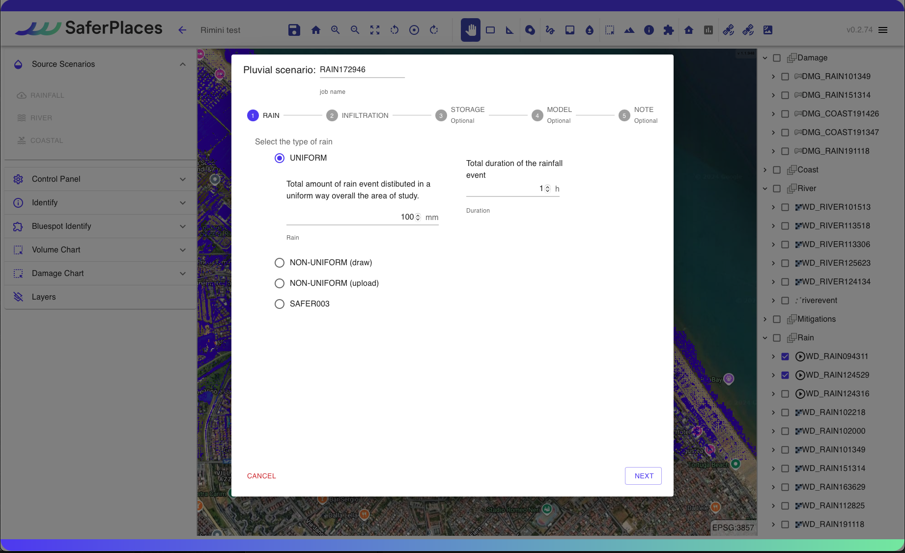
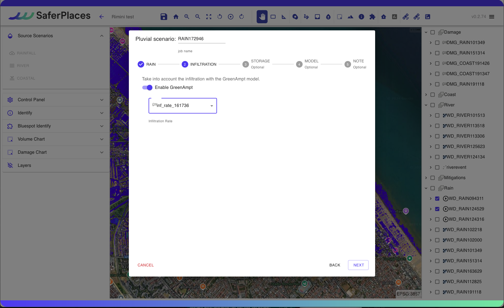
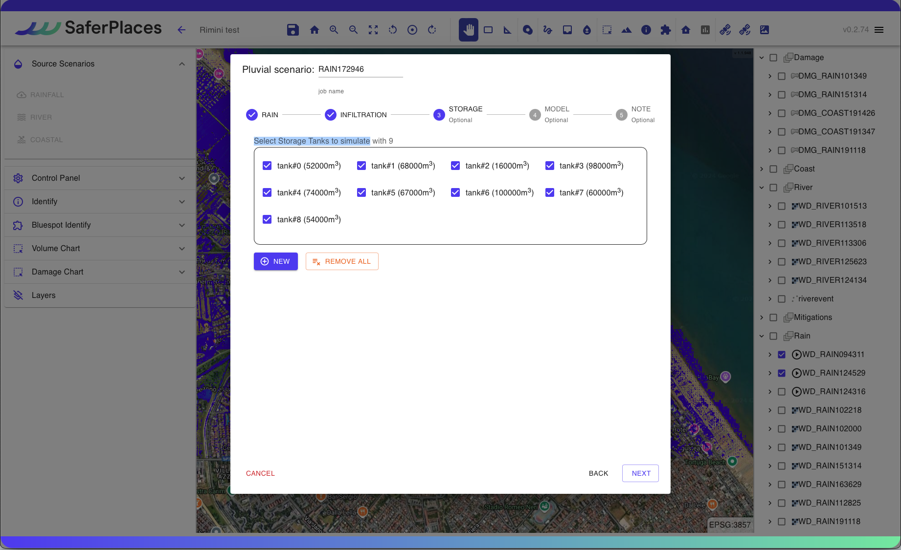
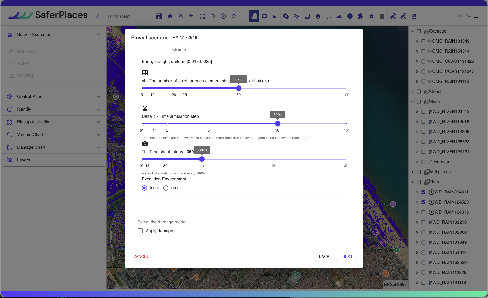

# 🌧️ Simulazione Allagamento Pluviale

#### Procedura per la Simulazione di Allagamenti Pluviali

Questa sezione descrive il processo per eseguire una simulazione di allagamento pluviale, causato da eventi meteorici di pioggia intensa e di breve durata. Tali eventi generano criticità nella gestione del deflusso delle acque superficiali, causando allagamenti particolarmente intensi in aree urbane depresse, come sottopassi.

## RAINFALL - SIMULAZIONE ALLAGAMENTO PLUVIALE

Il Wizard offre una procedura guidata dove l'utente definisce i seguenti dati e parametri di input:

Nome Simulazione

L'utente può modificare il nome assegnato automaticamente alla simulazione. Si consiglia di utilizzare caratteri standard e numeri senza spazi o simboli.

Definizione e caratterizzazione dell'Evento Pluviale -“<em>Pluvial scenario</em>” (1-RAIN)

IIl primo step, 1-RAIN, richiede la definizione e caratterizzazione dell'evento di pioggia da simulare in termini di intensità e durata.

L'utente può definire l'intensità di pioggia in mm in tre modi diversi:

1. **Uniforme su tutta l'area del dominio attivata**: Intensità (mm) costante su tutta l'area.
2. **Localizzata in una sottoarea con intensità non uniforme (disegno)**: Intensità variabile associata a un poligono disegnato dall'utente tramite lo strumento “_Rain_”  presente nella [barra-superiore.md](../../saferplaces-interfaccia-gui-web/barra-superiore.md "mention")
3. **Non uniforme (caricamento)**: Intensità variabile caricando un file raster in formato GeoTIFF, ad esempio da un prodotto RADAR METEO o MODELLO METEO FORECAST.
4. **Generato da prodotto satellitare**: Intensità (mm) determinata da un prodotto satellitare specifico.

L'utente può definire la durata dell'evento pluviale in ore (h) tramite il box "Total duration of the rainfall event".

Modello Infiltrazione del terreno (2-INFILTRATION)

Gli utenti possono attivare il modulo di infiltrazione nel terreno durante l'esecuzione della simulazione.

Il Modulo di Infiltrazione si basa sul Modello Green-Ampt e utilizza dati di input dai layer definiti nello [step-3-tasso-di-infiltrazione-raster-geotiff.md](../../gemello-digitale-e-attivazione-nuovo-servizio/creazione-digital-twin-e-attivazione-del-servizio-nellarea-di-interesse/step-3-tasso-di-infiltrazione-raster-geotiff.md "mention") e [step-4-litologia-raster-geotiff.md](../../gemello-digitale-e-attivazione-nuovo-servizio/creazione-digital-twin-e-attivazione-del-servizio-nellarea-di-interesse/step-4-litologia-raster-geotiff.md "mention")

Vasche di Accumulo (3-STORAGE)

Nella piattaforma SaferPlaces, come misura per mitigare il rischio, è possibile inserire Vasche di Accumulo (Storage Tanks) nel dominio di calcolo. Queste vasche aiutano a ridurre il volume d'acqua che inonda una specifica area o sotto-bacino durante la simulazione.

Gli Storage Tanks si possono posizionare come elementi puntiformi usando lo strumento "_Draw storage tank_", disponibile sia nel Wizard che nel pannello.

Per generare una Storage Tank, cliccare su "NEW". Questo permette di posizionare le vasche e assegnare a ognuna la capacità volumetrica in m³.

Nel riquadro "Select Storage Tanks to simulate", l'utente può selezionare o rimuovere le Vasche di Accumulo presenti. Con "REMOVE ALL" si deselezionano tutte le vasche selezionate.

Modello di calcolo (4-MODEL)

In questa sezione del Wizard l'utente ha la possibilità di&#x20;

1. Selezionare il modello di Allagamento (Hazard)
2. Attivare il calcolo del Dannno Economico (Damage)

I modelli di allagamento Pluviale disponibili sono:&#x20;

[safer\_rain.md](../modelli-di-allagamento-hazard-saferplaces/safer_rain.md "mention") - Modello Raster-based filling and spilling

[untrim.md](../modelli-di-allagamento-hazard-saferplaces/untrim.md "mention") - Modello Idrodinamico 2D

L'opzione di default è sempre il modello [safer\_rain.md](../modelli-di-allagamento-hazard-saferplaces/safer_rain.md "mention")

Nel caso si selezioni il modello [untrim.md](../modelli-di-allagamento-hazard-saferplaces/untrim.md "mention") occorre definire i seguenti parametri "Settings" cliccando sul task dedicato.&#x20;

* Slider - Durata della Simulazione in ore (h) -Tmax - Max time of simulation
* Slider - Coefficiente di scabrezza Manning  -Manning Coefficient
* Slider - Cella di calcolo in numero di pixel -nl - The number of pixel for each element side&#x20;
* Slider - Tempo di integrazione numerico  (min) -Delta T - Time simulation step
* Slider - Frequenza Stampa Output  (min) -Ti - Time shoot interval

L'attivazione del modello di calcolo del Danno Economico procede spuntando il check-box "Apply Damage"

Definizione dei parametri del modello di calcolo

**Modello SaferPlaces:** Per il modello di calcolo SaferPlaces, non sono necessari ulteriori parametri. Nelle simulazioni pluviali, il codice si attiva automaticamente.

&#x20;Nel caso delle simulazioni Pluviali si attiva automaticamente il codice [safer\_rain.md](../modelli-di-allagamento-hazard-saferplaces/safer_rain.md "mention")\

**Modello UNTRIM:** Se si sceglie il modello idrodinamico UNTRIM, è fondamentale specificare diversi parametri di simulazione tramite gli slider:

* **Durata della Simulazione (ore):** Selezionare una durata pari o superiore all'evento di pioggia; ad esempio, se la pioggia dura 2 ore, la simulazione deve essere di almeno 2 ore.
* **Coefficiente di Manning (adimensionale):** Un coefficiente di attrito uniforme ipotizzato nel dominio di calcolo. Valore consigliato: 0.2.
* **nl (m):** Dimensione della cella definita dal numero di pixel in metri. Per esempio, scegliendo 50 con una risoluzione Lidar di 2 m si ottiene una cella di 100 m. Per Lidar a risoluzione 1-2 m, si consigliano valori tra 20 e 50. La dimensione della cella influisce sul numero totale di celle, che a sua volta incide sul tempo di calcolo. Si consiglia di mantenere le celle sotto le 20.000 per tempi di calcolo gestibili (3 minuti per ogni ora di simulazione).
* **Delta T - Passo di Integrazione Numerico (sec):** Si consiglia un passo di integrazione di 6 secondi.
* **Ti - Intervallo di Tempo per gli Output (min):** Definire l'intervallo per la produzione degli output.

.png>)

.png>)

Attivazione Calcolo del danno economico - DAMAGE

Nella sezione "Model" della procedura guidata, è possibile attivare il calcolo del danno economico per ogni edificio inserito.

Il calcolo del danno economico viene eseguito inizialmente con le seguenti ipotesi:

1. Tutti gli edifici sono considerati residenziali, utilizzando una curva di vulnerabilità residenziale.
2. Valore dell'edificio fissato a 1000 euro/mq.

Inserimento metadati e descrizione della  simulazione generata (5- NOTE)

Cliccando sul pulsante EDIT l'utente può attivare una casella di testo dove inserire metadati e dettagli descrittivi della simulazione che ha appena creato.

RUN SIMULAZIONE

Cliccando sul pulsante RUN l'utente attiva l'esecuzione della simulazione creata.\
Dopo il lancio, il Pannello di Controllo visualizzerà l'esecuzione del processo con lo stato di avanzamento.

## Esempio di simulazione pluviale pioggia uniforme con SAFER



## Esempio di simulazione pluviale pioggia non uniforme con SAFER



## Esempio di simulazione pluviale con Storage Tank



## Esempio di simulazione pluviale con Modifica Infiltrazione



## #Esempio di simulazione pluviale - Modello UNTRIM

Part 1



Part2



