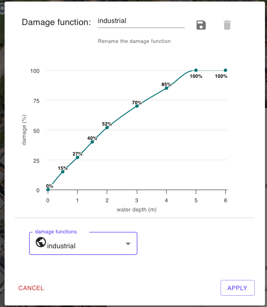

# 🏚️ Modello di Danno Economico - Safer\_DAMAGE

#### Parametri di Input del Modello Safer\_DAMAGE

Il modello Safer\_DAMAGE calcola il danno economico per ciascun edificio utilizzando i seguenti parametri:

* Superficie dell'area dell'edificio (footprint) - calcolata dalla geometria dello shapefile
* Valore Economico  al mq in EURSO/USD dell'edificio
* Valore della Water Depth (altezza d'acqua) Media per i pixel non nulli all'interno di un buffer di 2m
* Curva di Danno o Vulnerabilità (Damage Function) definita dall'utente mediante in tool [#strumento-curve-di-danno-e-valore-edifici](../saferplaces-interfaccia-gui-web/barra-superiore.md#strumento-curve-di-danno-e-valore-edifici "mention")

<figure><figcaption></figcaption></figure>

L'utente ha la possibilità di scegliere tra le curve di danno riportate nella pubblicazione Global Flood depth-damage functions: Methodologu and the database guidelines - [JRC](https://publications.jrc.ec.europa.eu/repository/handle/JRC105688)&#x20;

L'utente ha comunque la possibilità di caricare nuove e dedicate funzioni di danno oppure modificare quelle esistenti in funzione delle caratteristiche di vulnerabilità degli edifici.

Bibliografia modello Safer_DAMAGE

Un elenco aggiornato delle pubblicazioni relative alla validazione ed applicazione dei modelli di SaferPlaces è disponibile al seguente [link](https://saferplaces.co/scientifically-proven-hazard-and-damage-modelling/)

